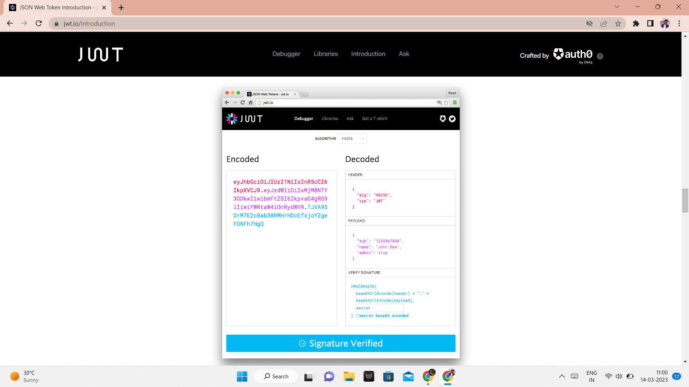
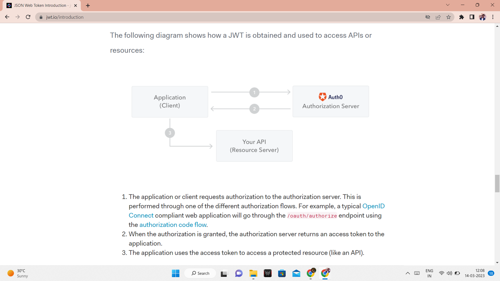
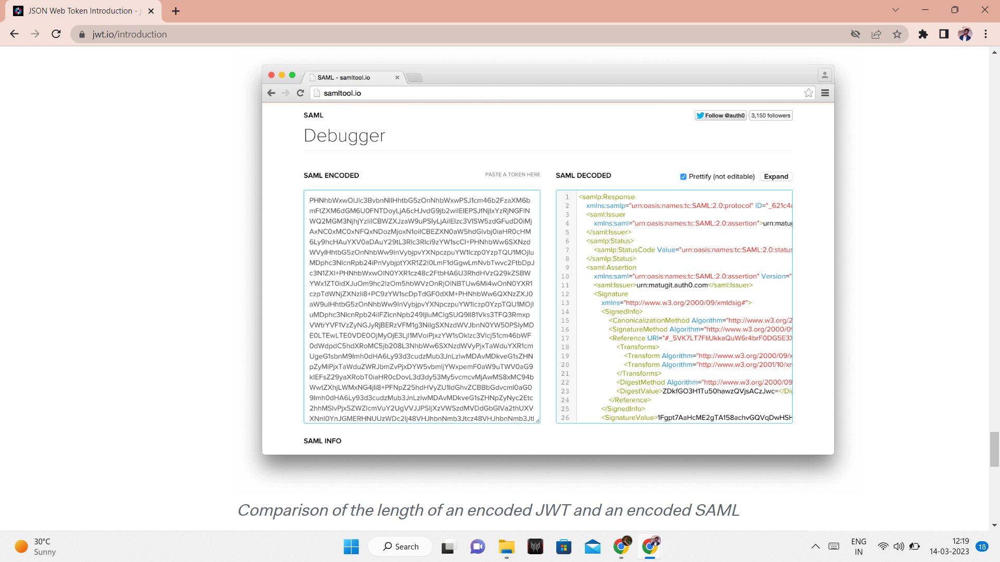

<h1> JWT - Javascript Object Notation(JSON) Web Token 😎</h1>
<h2>What is JSON web token?</h2>

               securely transmitting information between parties as a JSON object. This information can be verified and trusted because it is digitally signed. JWTs can be signed using a secret (with the HMAC algorithm) or a public/private key pair using RSA or ECDSA. 
   
Although JWTs can be encrypted to also provide secrecy between parties, we will focus on signed tokens. Signed tokens can verify the integrity of the claims contained within it, while encrypted tokens hide those claims from other parties. When tokens are signed using public/private key pairs, the signature also certifies that only the party holding the private key is the one that signed it.

 
<h2>When should you use JSON Web Tokens?</h2>
<blockquote>

Here are some scenarios where JSON Web Tokens are useful:…

<blockquote>
  
<strong>Authorization: </strong> This is the most common scenario for using JWT. Once the user is logged in, each subsequent request will include the JWT, allowing the user to access routes, services, and resources that are permitted with that token. Single Sign On is a feature that widely uses JWT nowadays, because of its small overhead and its ability to be easily used across different domains.

  
<strong>Information Exchange:</strong> JSON Web Tokens are a good way of securely transmitting information between parties. Because JWTs can be signed—for example, using public/private key pairs—you can be sure the senders are who they say they are. Additionally, as the signature is calculated using the header and the payload, you can also verify that the content hasn't been tampered with.

</blockquote>
</blockquote>
<h2><h2>When should you use JSON Web Tokens?</h2></h2>

In its compact form, JSON Web Tokens consist of three parts separated by dots (.), which are:

                              <uL><li>Header</li><li>Payload</li><li>Signature</li></ul>
                              
Therefore, a JWT typically looks like the following.

                              <code>xxxxx.yyyyy.zzzzz</code>
                              
Let's break down the different parts.

                              <h3>Header</h3>
                              
The header typically consists of two parts: the type of the token, which is JWT, and the signing algorithm being used, such as HMAC SHA256 or RSA.

                              
For example:

                              <code>{
  "alg": "HS256",
  "typ": "JWT"
}</code>

Then, this JSON is <strong><em> Base64Url</em></strong> encoded to form the first part of the JWT.

<h3>Payload</h3>

The second part of the token is the payload, which contains the claims. Claims are statements about an entity (typically, the user) and additional data. There are three types of claims: registered, public, and private claims.

<h4>Registered claims:</h4>

These are a set of predefined claims which are not mandatory but recommended, to provide a set of useful, interoperable claims. Some of them are: <b>iss</b> (issuer), <b>exp</b> (expiration time), <b>sub</b> (subject), <b>aud</b> (audience), and others.

  <em>Notice that the claim names are only three characters long as JWT is meant to be compact.</em>
<h4>Public claims:</h4>

These can be defined at will by those using JWTs. But to avoid collisions they should be defined in the IANA JSON Web Token Registry or be defined as a URI that contains a collision resistant namespace.

<h4>Private claims</h4>

These are the custom claims created to share information between parties that agree on using them and are neither registered or public claims.

 

An example payload could be:

<code>
{
  "sub": "1234567890",
  "name": "Naveen Prasath",
  "admin": true
}
</code>

The payload is then <strong><em> Base64Url</em></strong> encoded to form the second part of the JSON Web Token.

<em>Do note that for signed tokens this information, though protected against tampering, is readable by anyone. Do not put secret information in the payload or header elements of a JWT unless it is encrypted.</em>
<h3>Signature</h3>

To create the signature part you have to take the encoded header, the encoded payload, a secret, the algorithm specified in the header, and sign that.

For example if you want to use the HMAC SHA256 algorithm, the signature will be created in the following way:

<code>HMACSHA256(
  base64UrlEncode(header) + "." +
  base64UrlEncode(payload),
  secret)</code>

The signature is used to verify the message wasn't changed along the way, and, in the case of tokens signed with a private key, it can also verify that the sender of the JWT is who it says it is.

<b>Putting all together</b>

The output is three Base64-URL strings separated by dots that can be easily passed in HTML and HTTP environments, while being more compact when compared to XML-based standards such as SAML.

The following shows a JWT that has the previous header and payload encoded, and it is signed with a secret. 

<h2>How do JSON Web Tokens work?</h2>

In authentication, when the user successfully logs in using their credentials, a JSON Web Token will be returned. Since tokens are credentials, great care must be taken to prevent security issues. In general, you should not keep tokens longer than required.

You also <i> should not store sensitive session data in browser storage due to lack of security.</i>

Whenever the user wants to access a protected route or resource, the user agent should send the JWT, typically in the <b>Authorization</b> header using the <b>Bearer</B> schema. The content of the header should look like the following:

                                          
                               <pre ><code> 
                                           Authorization: Bearer <token>
</code></pre> 
              
 Use Authorization : Bearer and then add token within "< >"
                                    

  
This can be, in certain cases, a stateless authorization mechanism. The server's protected routes will check for a valid JWT in the <b>Authorization</b> header, and if it's present, the user will be allowed to access protected resources. If the JWT contains the necessary data, the need to query the database for certain operations may be reduced, though this may not always be the case.

    

    Note that if you send JWT tokens through HTTP headers, you should try to prevent them from getting too big. Some servers don't accept more than 8 KB in headers. If you are trying to embed too much information in a JWT token, like by including all the user's permissions, you may need an alternative solution, like <em>Auth0 Fine-Grained Authorization</em>.
    

    
If the token is sent in the <b>Authorization</b> header, Cross-Origin Resource Sharing (CORS) won't be an issue as it doesn't use cookies.

    
    
Do note that with signed tokens, all the information contained within the token is exposed to users or other parties, even though they are unable to change it. This means you should not put secret information within the token.

    <h2>Why should we use JSON Web Tokens?</h2>
    
Let's talk about the benefits of <strong>JSON Web Tokens (JWT)</strong> when compared to <strong>Simple Web Tokens (SWT)</strong> and<strong> Security Assertion Markup Language Tokens (SAML)</strong>.

    
As JSON is less verbose than XML, when it is encoded its size is also smaller, making JWT more compact than SAML. This makes JWT a good choice to be passed in HTML and HTTP environments.

    
Security-wise, SWT can only be symmetrically signed by a shared secret using the HMAC algorithm. However, JWT and SAML tokens can use a public/private key pair in the form of a X.509 certificate for signing. Signing XML with XML Digital Signature without introducing obscure security holes is very difficult when compared to the simplicity of signing JSON.

    
JSON parsers are common in most programming languages because they map directly to objects. Conversely, XML doesn't have a natural document-to-object mapping. This makes it easier to work with JWT than SAML assertions.

   <b> <em>Regarding usage, JWT is used at Internet scale. This highlights the ease of client-side processing of the JSON Web token on multiple platforms, especially mobile.</em> </b> 
    
    
    <h2>How JWT is useful?</h2>
    
JSON Web Tokens (JWTs) are useful in client-side applications because they allow for secure and authenticated communication between the client and the server without the need for a user to continually log in with each request. JWTs are also portable, meaning they can be used across <em>different platforms and languages, making them a flexible choice for modern web development</em>.

    <h3>Refer (installation): <a href="https://www.npmjs.com/package/jsonwebtoken">NPM</a></h3>
click on NPM to get more info

    
